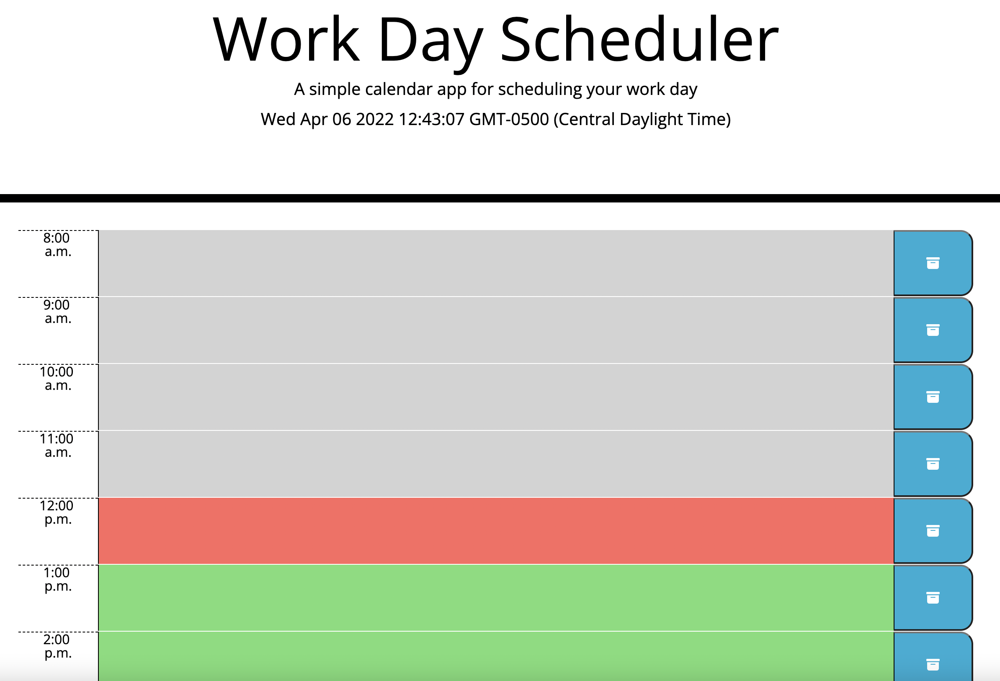

# Work Day Scheduler
In this deployed responsive application you will find a simple calendar application that allows a user to save events for each standard working hour of the day.

## Technologies
This app runs in the browser and feature dynamically updated HTML and CSS powered by **native** JavaScript.

Link to the deployed application: https://richardguarnieri.github.io/work-day-scheduler/

## Pseudocode
1. GIVEN I am using a daily planner to create a schedule
2. WHEN I open the planner
3. THEN the current day is displayed at the top of the calendar
4. WHEN I scroll down
5. THEN I am presented with timeblocks for standard business hours
6. WHEN I view the timeblocks for that day
7. THEN each timeblock is color coded to indicate whether it is in the past, present, or future
8. WHEN I click into a timeblock
9. THEN I can enter an event
10. WHEN I click the save button for that timeblock
11. THEN the text for that event is saved in local storage
12. WHEN I refresh the page
13. THEN the saved events persist

## Application Glimpse

Brief look at the application

